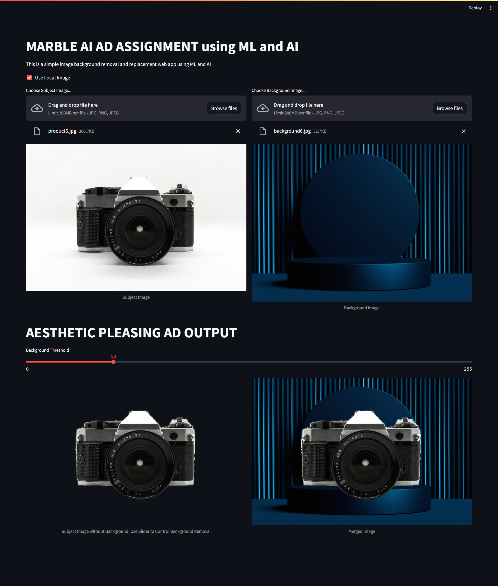

# AESTHETIC AD GEN APPLICATION

This Streamlit application provides a simple interface to remove the background from an image and replace it with another image. It utilizes machine learning and artificial intelligence techniques to accomplish this task.

## Prerequisites
- Python
- pip package manager

## Installation
1. Install Streamlit:
    ```
    pip install streamlit
    ```

2. Install rembg:
    ```
    pip install rembg
    ```

## How to Run
Execute the following command in your terminal to run the application:


## Usage
1. Upon running the application, it provides an interface to upload images or specify image URLs.
2. Choose the subject image and background image either by uploading local files or providing URLs.
3. Adjust the background removal threshold using the slider provided.
4. The application will generate a merged image with the background removed and replaced.
5. The final merged image can be viewed and downloaded from the application interface.

## Example
- **Subject Image:** The main image to which the background will be removed.
- **Background Image:** The image that will replace the removed background.
- **Merged Image:** The final image with the subject and background merged together.

### Note
- Ensure that the images provided have compatible formats such as JPG, PNG, or JPEG.
- The application is designed for aesthetic purposes and may not produce perfect results in all scenarios.

For more information, refer to the [Streamlit documentation](https://streamlit.io) and [rembg documentation](https://github.com/danielgatis/rembg).


## Final Look


